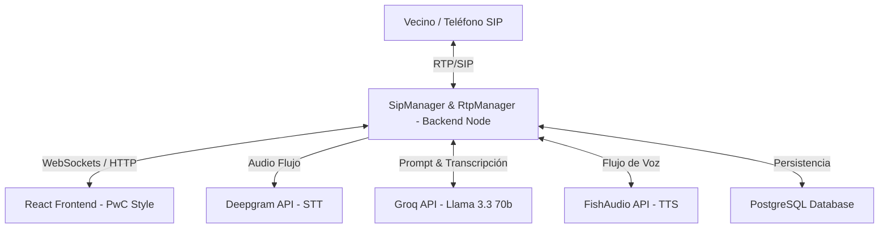
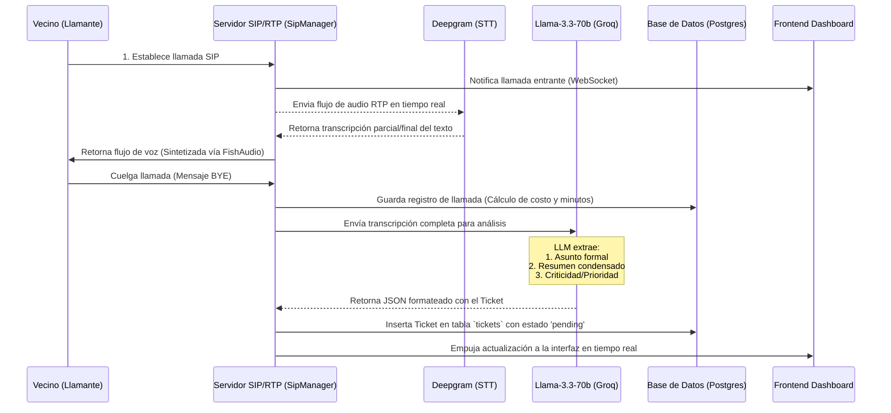

# DOSSIER TÉCNICO Y MANUAL DE OPERACIÓN
## Sistema VoIP de Atención Municipal con Inteligencia Artificial
### **Plataforma: JOBAAJ Call Center AI**

---

## 1. Introducción y Propósito del Sistema

El **JOBAAJ Call Center AI** es una plataforma de software de nivel empresarial diseñada para automatizar y optimizar la atención telefónica al ciudadano en entornos municipales. Utilizando tecnologías avanzadas de telecomunicaciones (SIP/RTP) e Inteligencia Artificial de última generación (LLMs, STT y TTS de ultra-baja latencia), el sistema actúa como un agente de voz inteligente que atiende de forma autónoma las consultas de los vecinos.

### **Objetivos Clave de la Plataforma:**
*   **Automatización de Consultas**: Responder de forma interactiva y natural a las preguntas y quejas de los vecinos las 24 horas del día.
*   **Gestión Inteligente de Reportes**: Analizar el audio de cada llamada para extraer de forma automática el asunto, resumen y criticidad, convirtiendo la conversación en un ticket digital de acción directa.
*   **Transparencia Financiera**: Registrar detalladamente el costo por segundo de cada llamada (integrando los recursos de procesamiento, transcripción e IA) para ofrecer reportes analíticos consolidados de la inversión pública.
*   **Eficiencia Operativa**: Ofrecer a los administradores municipales un panel de control con métricas operativas y un sistema de gestión (CRM) para el seguimiento de los tickets.

---

## 2. Arquitectura Tecnológica y Stack de Desarrollo

El sistema está construido siguiendo los estándares de diseño modernos de alta concurrencia, dividiendo la carga de trabajo de forma eficiente entre frontend, backend y los motores de IA.



### **1. Core Backend (Node.js & TypeScript)**
*   **Motor de Telefonía**: Servidor SIP/RTP embebido que gestiona las conexiones en tiempo real sin intermediarios lentos.
*   **WebSockets (Socket.io)**: Sincronización en tiempo real con la interfaz de usuario para mostrar alertas de llamadas entrantes, actualizaciones de estado y cambios de métricas al instante.
*   **Persistencia**: PostgreSQL, optimizado para almacenar registros estructurados de llamadas (`calls`), transcripciones detalladas (`transcripts`) y reportes automatizados (`tickets`).

### **2. Frontend Avanzado (React & Tailwind CSS)**
*   **Diseño Premium (PwC Style)**: Una interfaz moderna y limpia inspirada en las mejores firmas corporativas globales. Colores corporativos seleccionados, tipografía geométrica (Outfit/Inter) y micro-animaciones dinámicas.
*   **Visualización de Datos**: Integración con **Recharts** para renderizar gráficos responsivos de volumen operativo y tendencias de gastos financieros sin latencia de renderizado.

### **3. Pipeline de Inteligencia Artificial (AI Engine)**
*   **Reconocimiento de Voz (STT)**: Deepgram, procesando audio en tiempo real para generar transcripciones fluidas con un margen de error menor al 3%.
*   **Generación de Respuestas y Tickets**: Llama-3.3-70b (alojado en Groq) configurado con prompts de contexto estructurado para actuar como el asistente municipal de Jobaaj y, al finalizar la llamada, realizar la extracción automática del ticket.
*   **Síntesis de Voz (TTS)**: FishAudio, entregando voz sintetizada realista y con entonación natural humana para evitar el efecto robótico tradicional.

---

## 3. Módulos de la Plataforma

La plataforma de control administrativa está organizada en tres áreas de acción bien delimitadas:

### **Módulo 1: Centro de Control (Dashboard Principal)**

Este panel está enfocado exclusivamente en la **operación y rendimiento técnico** en tiempo real del call center municipal.

#### **Métricas Clave Incluidas:**
*   **Total Llamadas**: El acumulado histórico de llamadas recibidas y procesadas por la plataforma.
*   **Contestadas (%)**: Porcentaje real de llamadas que han sido atendidas exitosamente por la inteligencia artificial.
*   **Tiempo Promedio**: Duración media de las interacciones con los ciudadanos.
*   **Tickets Activos**: El recuento en tiempo real de los reportes generados automáticamente por la IA que requieren atención municipal.

#### **Visualizaciones Gráficas:**
*   **Estado de Respuesta (Donut Chart)**: Un gráfico circular segmentado que compara las llamadas contestadas frente a aquellas que no pudieron completarse.
*   **Volumen Semanal (Bar Chart)**: Representación de barras en color rojo corporativo que muestra el tráfico histórico diario de llamadas para analizar picos de demanda.
*   **Estado de Conexión SIP**: Indicador dinámico de estado en la parte inferior izquierda de la pantalla que reporta la conexión directa con el servidor SIP central.


---

### **Módulo 2: Control de Gestión y Reportes Financieros (Llamadas)**

Este módulo se especializa en el **seguimiento económico e historial detallado** del uso de recursos. Permite auditar y evaluar el costo-beneficio de la IA.

#### **Métricas Clave de Gasto:**
*   **Total Minutos**: Suma exacta de minutos hablados entre la IA y los vecinos.
*   **Gasto Total (USD)**: Costo financiero acumulado exacto de las llamadas, calculado segundo a segundo.
*   **Costo/Min**: La media de gasto por minuto de conversación, ideal para evaluar costes de operación frente a centros de llamadas tradicionales.

#### **Visualizaciones Gráficas y Detalle:**
*   **Análisis de Gastos Diarios (AreaChart)**: Gráfica de área suave en color rojo degradado que mapea las variaciones diarias en los costos para tener control del presupuesto.
*   **Historial Detallado con Costo Individual**: Listado de llamadas completo donde cada fila muestra el número del llamante, fecha y hora de la llamada, duración exacta de la conversación y el **costo individualizado** en dólares con precisión de cuatro decimales.


---

### **Módulo 3: CRM Automatizado de Reportes (Tickets AI)**

El corazón de la atención al ciudadano. Este módulo automatiza la creación de ordenanzas y tickets de servicio basándose únicamente en el contenido hablado de la llamada, eliminando la necesidad de entrada de datos manual.

#### **Métricas de Control de Tickets:**
*   **Total Tickets**: Número total de reportes e incidencias generadas en el sistema.
*   **Sin Atender**: Cantidad de tickets nuevos creados por la IA que aún no han sido revisados.
*   **En Proceso**: Reportes que actualmente están en fase de resolución por el personal del municipio.
*   **Culminados**: Tickets de vecinos cuya problemática ha sido resuelta satisfactoriamente.

#### **Gestión Operativa Avanzada:**
*   **Gráfica de Actividad Diaria**: Análisis de volumen diario de tickets generados para predecir días con mayores incidencias reportadas.
*   **Flujo de Trabajo por Estados (Tabs)**: Pestañas premium ("SIN ATENDER", "EN PROCESO", "CULMINADOS") para organizar el flujo de trabajo operativo de los gestores municipales.
*   **Filtros de Prioridad**: Selector dinámico de urgencia (Urgente, Alta, Media, Baja) basado en el análisis de gravedad realizado por la Inteligencia Artificial.
*   **Modal de Gestión y "Ver Detalle"**: Al hacer clic en un ticket, se despliega una interfaz dedicada que muestra el número telefónico del vecino, la fecha de creación, el asunto estructurado, el **Resumen Inteligente** del reporte de la IA y botones de acción rápida para cambiar el estado (ej: "Marcar como Culminado") lo que actualiza la base de datos de manera inmediata.


---

## 4. El Pipeline de Procesamiento de IA (Paso a Paso)

El flujo de información desde que un vecino llama hasta que se visualiza su ticket en la plataforma se ejecuta siguiendo un estricto pipeline secuencial que garantiza la fidelidad de los datos:



### **1. Fase de Conversación y Transcripción**
Durante la llamada, el vecino describe su situación. El `RtpManager` captura el audio y lo canaliza de forma asíncrona hacia Deepgram. La transcripción se va acumulando de forma estructurada en la memoria del backend.

### **2. Finalización e Inserción del Historial**
Al colgar la llamada, el método `handleBye` del `SipManager` detiene la grabación, calcula el costo total exacto del procesamiento en base a la duración exacta de la llamada, e inserta el registro en la tabla `calls` de la base de datos PostgreSQL.

### **3. Generación Asíncrona del Ticket (Post-Call Analysis)**
Inmediatamente después de cerrar el registro de llamada, se dispara una rutina en segundo plano (`TicketGenerator.ts`). Esta rutina toma la transcripción acumulada y realiza una llamada estructurada al modelo `llama-3.3-70b` en Groq con un prompt de sistema estricto:
```json
{
  "subject": "Formulación formal del asunto del reporte del ciudadano",
  "summary": "Resumen condensado con los datos clave aportados por el vecino (nombres, direcciones, incidentes)",
  "priority": "urgent | high | medium | low"
}
```

### **4. Sincronización del CRM**
El resultado en formato JSON estructurado devuelto por el LLM se almacena en la tabla `tickets` vinculada a la llamada original mediante su `call_id` y con el estado inicial `pending` (Sin Atender). Esto gatilla de forma asíncrona la actualización de los paneles mediante WebSockets, permitiendo al administrador municipal ver el ticket en pantalla apenas segundos después de que el vecino ha colgado el teléfono.

---

## 5. Arquitectura del Esquema de Datos (Base de Datos)

El sistema utiliza tres tablas clave en PostgreSQL para asegurar la integridad referencial y permitir análisis complejos de gastos y gestiones:

### **1. Tabla: `calls`**
Almacena el registro principal de cada interacción telefónica.
*   `id` (UUID / Primary Key): Identificador único de la llamada.
*   `caller_id` (VARCHAR): El número telefónico del ciudadano.
*   `started_at` (TIMESTAMP): Marca de tiempo del inicio.
*   `ended_at` (TIMESTAMP): Marca de tiempo de la desconexión.
*   `cost` (DECIMAL): Costo financiero exacto calculado de la llamada.
*   `status` (VARCHAR): Estado de respuesta (ej: `answered`, `failed`).

### **2. Tabla: `transcripts`**
Contiene el flujo conversacional detallado para auditoría.
*   `id` (SERIAL / Primary Key).
*   `call_id` (UUID / Foreign Key -> `calls.id`): Enlace directo a la llamada.
*   `role` (VARCHAR): Quién habló (`user` o `assistant`).
*   `content` (TEXT): El mensaje transcrito o sintetizado.
*   `created_at` (TIMESTAMP).

### **3. Tabla: `tickets`**
Contiene la información de gestión ciudadana estructurada por IA.
*   `id` (SERIAL / Primary Key).
*   `call_id` (UUID / Foreign Key -> `calls.id`): Enlace al ciudadano que originó el reporte.
*   `subject` (VARCHAR): Título del ticket de la llamada.
*   `summary` (TEXT): Resumen analítico.
*   `priority` (VARCHAR): Criticidad determinada (`urgent`, `high`, `medium`, `low`).
*   `status` (VARCHAR): Estado del flujo del CRM (`pending`, `in_progress`, `completed`).
*   `created_at` (TIMESTAMP).

---

## 6. Conclusión y Valor Estratégico

El **JOBAAJ Call Center AI** representa la vanguardia en soluciones tecnológicas para la gestión pública municipal:
1.  **Reducción de Costes**: Atiende miles de llamadas simultáneas sin necesidad de saturar centros de atención físicos o contratar operadores adicionales para turnos nocturnos.
2.  **Agilidad Ciudadana**: El vecino es atendido al instante, sin tiempos de espera, y su queja es clasificada y redactada en segundos de forma impecable.
3.  **Transparencia Financiera Total**: La integración de reportes de costes permite a la administración pública auditar la inversión de recursos tecnológicos con absoluta transparencia.
4.  **Flujo Operativo Cerrado**: Desde el teléfono del ciudadano hasta el CRM del gestor municipal, no existe pérdida de información, garantizando una administración eficaz orientada a la resolución de problemas.

---
*Fin del Dossier Técnico - JOBAAJ Call Center AI*
